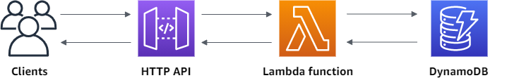

# Serverless To-Do List REST API

**مشروع تخرج AWS Solutions Architect - Associate**  
**اسم الطالب:** أحمد محمود  
**التاريخ:** فبراير 2026

## Solution Architecture Diagram


## الخدمات المستخدمة (Key AWS Services)
- **Amazon API Gateway** (HTTP API) - يعرض الـ REST endpoints
- **AWS Lambda** - ينفذ الـ CRUD operations
- **Amazon DynamoDB** - قاعدة بيانات NoSQL لتخزين المهام
- **Amazon S3** - لرفع الـ Frontend (صفحة HTML بسيطة)

## How it works (شرح بسيط)
1. اليوزر يفتح صفحة ويب على S3
2. يضغط Add / View / Delete مهمة
3. API Gateway يستقبل الطلب ويحوله لـ Lambda
4. Lambda يعمل Create/Read/Update/Delete في DynamoDB
5. النتيجة ترجع JSON للصفحة

## Deployment Steps (خطوة بخطوة - لو كان عندي فيزا كنت عملتها كده)
1. أنشأت DynamoDB Table اسمها `TodoTable` (Partition key: id - String)
2. أنشأت Lambda Function بـ Python 3.12 مع الكود أدناه
3. أنشأت HTTP API في API Gateway وربطته بالـ Lambda
4. فعّلت CORS عشان الـ Frontend يشتغل
5. رفعت صفحة HTML بسيطة على S3 وخليتها Static Website

## Lambda Function Code (الكود كامل جاهز)
```python
import json
import boto3
from decimal import Decimal

dynamodb = boto3.resource('dynamodb')
table = dynamodb.Table('TodoTable')

def lambda_handler(event, context):
    headers = {"Content-Type": "application/json"}
    try:
        if event['routeKey'] == "GET /tasks":
            response = table.scan()
            items = response.get('Items', [])
            body = [{'id': item['id'], 'task': item.get('task'), 'done': item.get('done', False)} for item in items]
        
        elif event['routeKey'] == "POST /tasks":
            data = json.loads(event['body'])
            table.put_item(Item={'id': data['id'], 'task': data['task'], 'done': False})
            body = {'message': 'Task created'}
        
        elif event['routeKey'] == "DELETE /tasks/{id}":
            table.delete_item(Key={'id': event['pathParameters']['id']})
            body = {'message': 'Task deleted'}
        
        else:
            body = {'message': 'Method not allowed'}
            
        return {"statusCode": 200, "headers": headers, "body": json.dumps(body)}
    
    except Exception as e:
        return {"statusCode": 400, "headers": headers, "body": json.dumps({"error": str(e)})}
